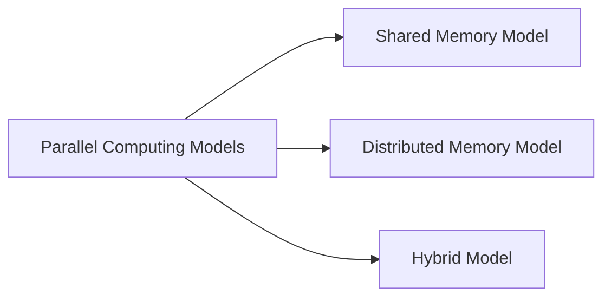

Overview:
# High Performance Computing: Motivating Parallelism
Detailed Explanation:

## Overview:

High Performance Computing (HPC) is a practice that leverages powerful processing capabilities to handle large data volumes and perform complex computations. One of the key aspects of HPC is parallelism, which is the concept of doing multiple things simultaneously rather than sequentially. Parallelism is motivated by the need to solve large-scale problems, reduce the time to solution, or to provide high throughput for multiple tasks.

## Details:

### 1. **Need for Parallelism**

- **Large-Scale Problems:** Some problems are so large and complex that they require the computational power of multiple processors working in parallel. For example, climate modeling, genomic analysis, and large-scale simulations.

- **Time to Solution:** In many cases, a single processor cannot provide a solution in a reasonable time. Parallelism allows the problem to be divided into smaller parts that can be solved simultaneously, reducing the overall time to solution.

- **High Throughput:** In some scenarios, the goal is not to solve a single large problem, but to process many small tasks. Parallelism enables high throughput by allowing these tasks to be processed concurrently.

### 2. **Types of Parallelism**

- **Data Parallelism:** In data parallelism, the data is divided among multiple processors and the same operation is performed on each data subset. This type of parallelism is common in array processing and matrix operations.

- **Task Parallelism:** In task parallelism, different operations are performed on the same or different data. This type of parallelism is common in complex simulations where different tasks can be performed independently.

### 3. **Challenges in Parallelism**

- **Load Balancing:** It is essential to ensure that all processors share the computational load equally. If one processor is idle while others are working, it can lead to inefficiencies.

- **Communication Overhead:** Communication between processors can introduce significant overhead, especially in distributed memory systems. The time taken to transfer data between processors can sometimes outweigh the benefits of parallelism.

- **Data Dependencies:** Some tasks cannot be started until others have finished due to data dependencies. This can limit the degree of parallelism that can be achieved.

### 4. **Parallel Computing Models**

- **Shared Memory Model:** In this model, all processors have access to a shared memory. The advantage of this model is its simplicity and speed of communication. However, it doesn't scale well to a large number of processors.

- **Distributed Memory Model:** In this model, each processor has its own private memory. Data is transferred between processors through a communication network. This model scales well to a large number of processors but has a higher communication overhead.

- **Hybrid Model:** This model combines the shared and distributed memory models. It aims to leverage the advantages of both models.

In summary, parallelism in High Performance Computing is motivated by the need to solve large-scale problems, reduce the time to solution, or provide high throughput. However, achieving effective parallelism requires overcoming challenges such as load balancing, communication overhead, and data dependencies. Various parallel computing models are used to address these challenges.